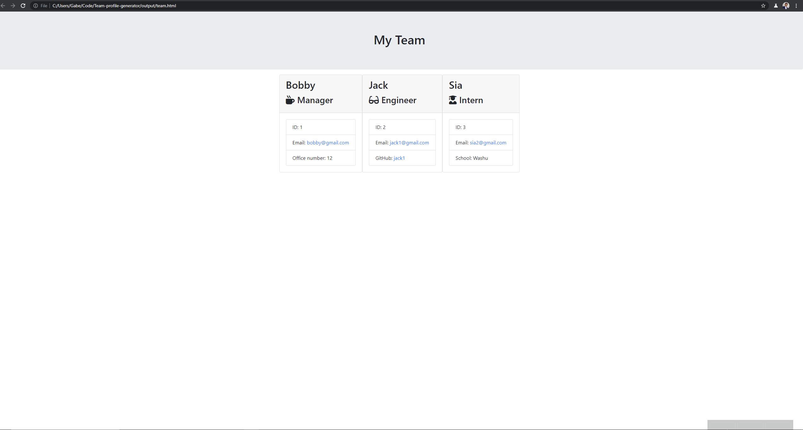

# Team Profile Generator

## Description
An app that generates an HTML file displaying the Employees on a team, based on user input into the terminal. Created using JavaScript, Node.js, Jest, and Inquirer.

## Video Walk-through
https://drive.google.com/file/d/1T8Bj1ZL5hXQ9rs7XCu7zhqWTIPKemkRv/view

## Table of Contents
* [Installation](#installation)
* [Usage](#usage)
* [Contributing](#contributing)
* [Tests](#tests)
* [License](#license)
## Installation

*Steps required to install this project and get the application running:*

Node.js and Inquirer are needed to run this application.
 ## Usage
*Instructions for use:*
This project is for anyone who wants to build a profile page for their work team. Initially, it runs in the Node.js environment and the user answers prompts about their team and this program will create a profile visualization of the whole team in an HTML file.

## License
Open

### Questions?
For any questions, please contact me with the information below:
GitHub: [babelitoo](https://github.com/babelitoo)
